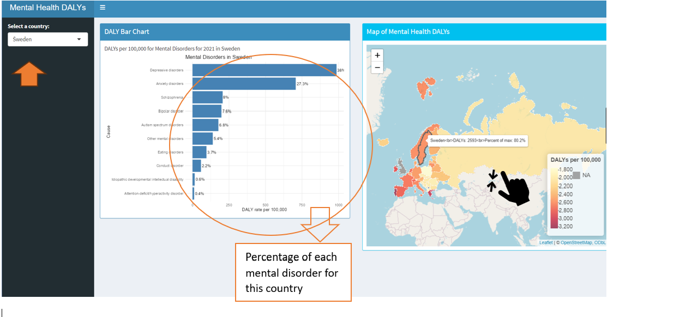

## Introduction

This report presents an interactive Shiny application that visualizes mental health Disability-Adjusted Life Years (DALYs) across Europe using 2021 data. The app includes a choropleth map and a country-specific bar chart to explore patterns in mental disorders.

---

## Data Description

The data was sourced from the Global Burden of Disease database and includes:
- **DALYs per 100,000** population
- Breakdown by **country**, **age**, **sex**, and **cause**

---

## Functionality Overview

The app allows users to:
- Select a **country** to view DALY rates by mental disorder
- Click on the **map** to interactively filter the chart
- View **percent contributions** of each disorder

---

## Key Features Demonstrated

- `shiny` and `shinydashboard` for UI
- `ggplot2` for bar chart rendering
- `leaflet` for interactive mapping
- `sf`, `dplyr`, and `rnaturalearth` for spatial and data processing

---

## Screenshots
Below is a screenshot of the Shiny application interface.

Users can navigate the app by:
- Selecting a country from the dropdown menu on the left
- Or clicking a country directly on the interactive map
- The bar chart on the left updates based on the selected country
- Hovering over the map provides DALY values and highlights the selected region
```{r screenshot, echo=FALSE, out.width="100%"}



```{r, include=FALSE}
knitr::opts_chunk$set(
  collapse = TRUE,
  comment = "#>"
)
```

```{r setup}
library(secondassignment)
```
